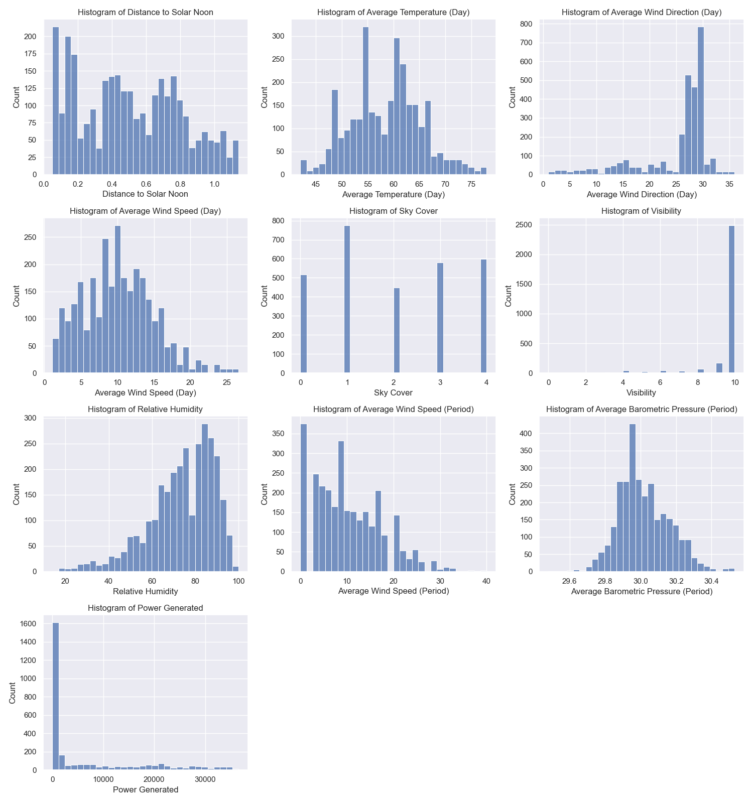
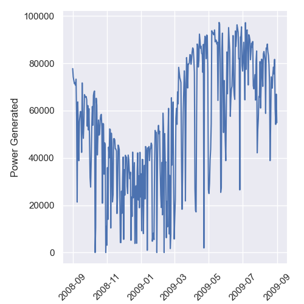
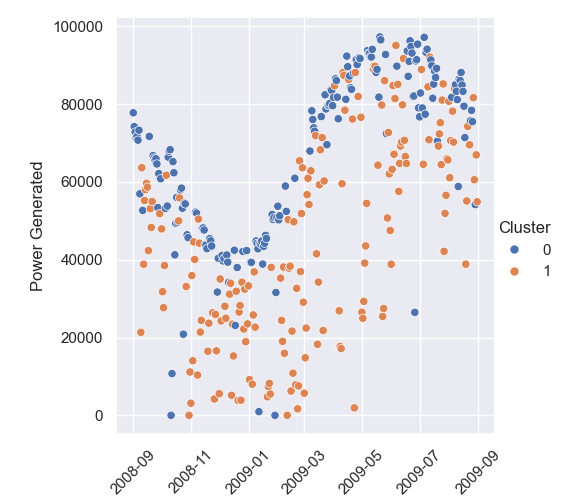
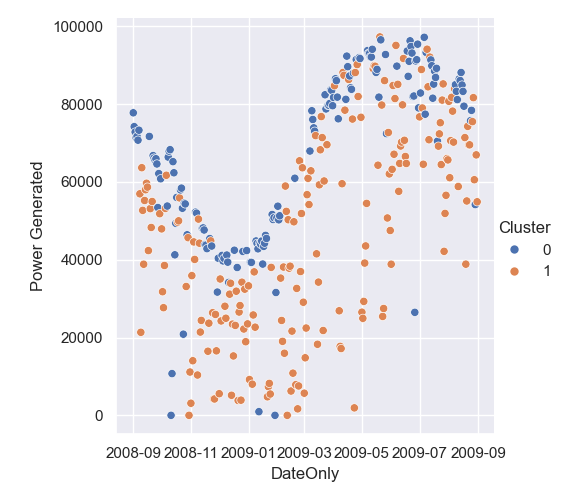

# Answers

Made by Johannes van de Locht, Anna Beckers and Finn Kalvelage

## 1 a)

## 1 b)

The most power was generated on 2009-05-20 with a value of 97262.

## 1 c)

scatter plot with manual clustering:

scatter plot with kmeans clustering:

With both clustering methods we can see that cluster 0 with values below or equal to 2 have on average higher power generation per day. This trend is consistent over the seasons, but with stark differences in actual power generation. Both clusters show overlap and even with multiple different threshholds tested they could not be divided. This shows that even though there is a general connection there must be more factors that determine the power generation.
